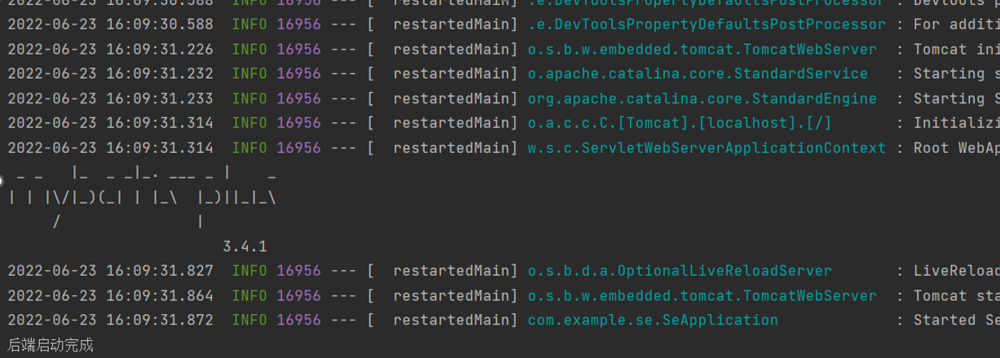

TEACH_EVAL_SYS
====
## 1 安装
本线上教学评价推荐系统暂时只能在本地进行运行，为了保障正常通信，建议客户将项目运行在本机上，使用本机的ip地址或localhost:8080地址进行访问。
### 1.1 项目的前置依赖软件或库的安装

运行本项目前，请确保您已安装：Node.js（npm），element-plus，vue3.x，element-plus和axios；后端需要安装springboot框架和mybatis依赖以及mysql的jdbc。
### 1.2	项目的本地安装

本项目可直接使用发布的版本进行本地的运行，步骤如下:
- 通过命令行进入该项目目录
- 打开数据库，到mysql的bin目录下键入mysql -uroot -p，并开启后端服务器，运行SeApplication.java文件，得到如下结果及为启动成功（出现提示：后端启动完成）

- 键入命令npm run serve开启本机作为服务器

    ```sh
    npm run serve
    ```

- 进入前端程序代码，更改App.vue的ip地址，本机做服务器，换成本机的ipv4

    

- 根据提示进入地址 http://localhost:8080/ 或 http://10.131.168.160:8080/ ，其中10.131.168.160为本机的ip地址

    
- 根据页面上的提示进行操作即可
## 2 使用
进入本项目的主页后，点击登录按钮进入登录界面：
进入登录界面后，选择用户类型，输入账号和密码后，点击完成进行提交，根据账号密码是否匹配提示相应信息。
### 2.1 学生
登录成功后，自动转入个人主页，学生具有以下三个功能：查询本学期已修课程并评教、根据关键词搜索课程，获得推荐课程。
- 查询本学期已修课程：点击该功能卡将会弹出页面弹窗，显示该学生本学期已修的课程和评教状态。对于已评教的课程，点击我要评教时系统会提示已进行过评教；对于未评教的课程，点击我要评教时系统会跳转至评教界面。
- 评教：学生填写评教界面的问卷，其中前四项为打分（满分十分，打分从低到高代表该学生对该项的满意程度逐渐增加），最后一项为填写对该课程的评价。
- 根据关键词搜索课程：学生可根据关键词教师名和课程名进行查询获得相关课程，点击提交按钮后页面跳转到展示结果界面，点击课程栏的查看详情按钮可以查看该课程的具体评价。
- 获取系统的推荐课程：学生可点击推荐课程进入结果展示页面查看课程信息，随后可以点击查看详情按钮查看该课程的具体评价。
- 学生可以随时通过页面上方导航栏进行页面切换，也可以通过点击导航栏的退出图标进行退出和重新登录

### 2.2	教师
登录成功后，自动转入个人主页，教师具有以下两个功能：查询本学期已教授课程、根据关键词搜索课程
- 查询本学期已教授课程：点击该功能卡将会弹出页面弹窗，显示该教授本学期已教授的课程。
- 根据关键词搜索课程：教师可根据关键词教师名和课程名进行查询获得自己教授的课程和其他相关课程，点击提交按钮后页面跳转到展示结果界面，点击课程栏的查看详情按钮可以查看该课程的具体评价。
- 教师可以随时通过页面上方导航栏进行页面切换，也可以通过点击导航栏的退出图标进行退出和重新登录。

### 2.3	管理员
登录成功后，自动转入个人主页，管理员具有以下三个功能：注册和修改账户信息，注册课程，增加选课信息
- 注册和修改账户信息：点击该功能卡将会弹出页面弹窗，管理员可填写信息注册新的账户，若新的账户信息中账户名已存在，则新填写的信息将覆盖该账户名对应的账户。
- 注册或修改课程信息：点击该功能卡将会弹出页面弹窗，管理员可填写信息注册新的课程，若新的课程信息中课程编号已存在，则新填写的信息将覆盖该课程编号对应的课程。
- 增加选课信息：点击该功能卡将会弹出页面弹窗，管理员可填写信息加入学生选修课程的情况。
管理员可以随时通过页面上方导航栏进行页面切换，也可以通过点击导航栏的退出图标进行退出和重新登录。

### 2.4	其他页面
- Home页面包含了本系统的主界面和登录入口
- About界面包含了系统管理员的联系方式
- Personal界面使得已登录的用户可以随时回到个人主页
- Contact us界面使得用户可以联系制作者团队

### 3 卸载
该系统的卸载可以通过删除发布的代码文件。
